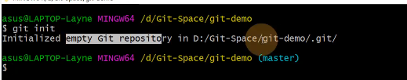

# git
## 一、常用命令
- git config --global user.name 用户名          设置用户签名
- git config --global user.email 邮箱              设置用户签名
- git init                                                           初始化本地库
- git status                                                       查看本地库状态
- git add 文件名                                               添加到缓存区
- git commit -m "日志信息“  文件名                提交到本地库
- git reflog                                                        查看历史记录
- git reset --hard 版本号                                   版本穿梭


## 二、流程
### 1、初始化本地库
#### git init

### 2、暂存区
- git add 文件名                                    添加到缓存区
- git rm --cached 文件名                       从缓存区删除

### 3、本地库
- git commit -m “日志信息” 文件名      将暂存区文件提交到本地库
- git reflog                                             查看版本
- git flog                                                查看详细日志
### 4、历史版本和版本穿梭
- git reflog                                             查看版本信息
- git log                                                  查看版本详细信息
- git reset --hard 版本号                        版本穿梭
### 5、分支操作
 - 同时并行推进多个功能开发，提高开发效率。
 - 各个分支在开发过程中，如果某一个分支开发失败，不会对其他分支有任何影响。

- git branch 分支名                                创建分支
- git branch -v                                        查看分支
- git checkout 分支名                             切换分支
- git merge 分支名 ~~被合并的分支名~~       把指定的分支合并到当前分支上

##### 合并冲突
- 合并分支时，两个分支在同一个文件的同一个位置有两套完全不同的修改，Git无法替我们决定使用哪一个，必须人为决定新代码内容
###### 解决冲突
- 1) 编辑有冲突的文件，删除特殊符号，决定要使用的内容
		特殊符号：<<<<<HEAD  当前分支的代码  ===== 合并过来的代码 >>>>hot-fix
- 2) 添加到缓存区
		git add 文件名
- 3) 执行提交（注意：此时使用 git commit 命令 不能带文件名）
### 6、Github操作
		
		git remote -v                    查看当前所有远程地址别名
		git remote add 别名 远程地址       起别名
		git push 别名 分支                 推送本地分支上的内容到远程仓库
		git clone 远程地址                 将远程仓库的内容克隆到本地
		git pull 别名 远程分支名            将远程仓库对于分支最新内容拉取到本地，并与其合并

- 1) 创建远程仓库
			![[image/2.png]]
		- 自动跳转到下面页面：
		![[image/3.png]]
- 2) 初始化本地仓库
		git init
- 3) 添加别名
		git remote add 别名 连接地址
- 4) 配置SSH密钥
	1、生成密钥对
		```ssh-keygen -C "comment"```     comment为备注，可写可不写
	2、获取密钥
		进入用户目录，.ssh文件夹
		打开id_rsa.pub，复制
	3、Github，settings，SSH and GPG Keys, New SSH Keys :输入密钥
- 5) 提交推送
	```git add .```
	eg:```    git add .                          提交所有修改的和新建的数据暂存区
         git add -u <==> git add –update    提交所有被删除和修改的文件到数据暂存区
         git add -A <==>git add –all        提交所有被删除、被替换、被修改和新增的文件到数据暂存区```
- 6) 提交文件
   ```git commit -m "comment"```
- 7) 推送
  ```git push -u 别名 master```
